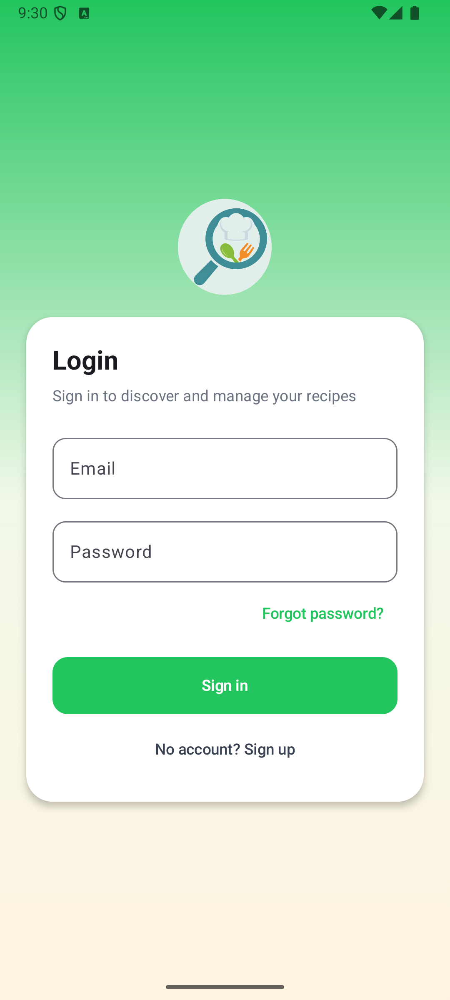
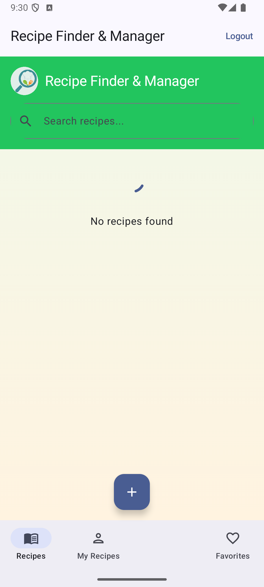
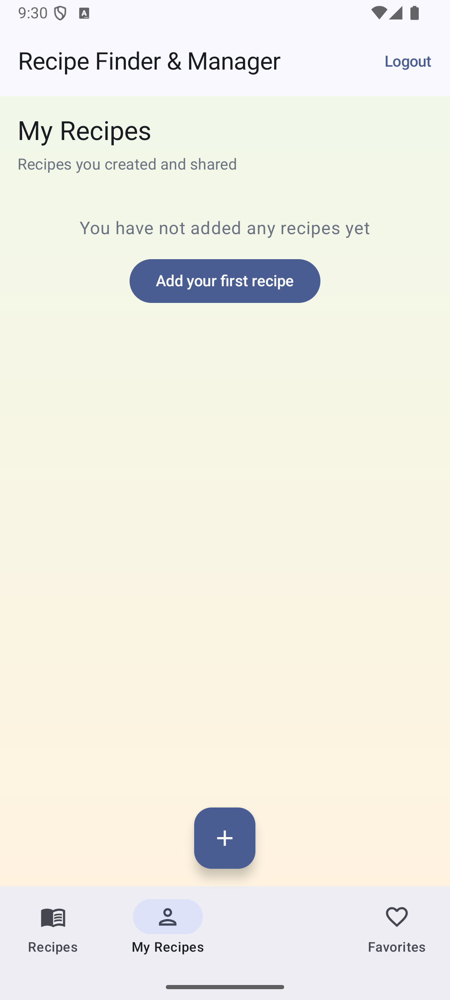
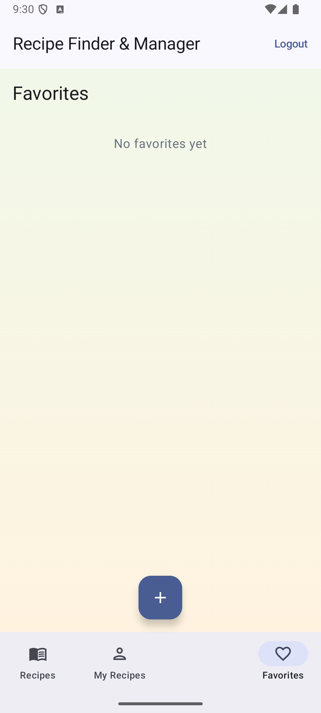
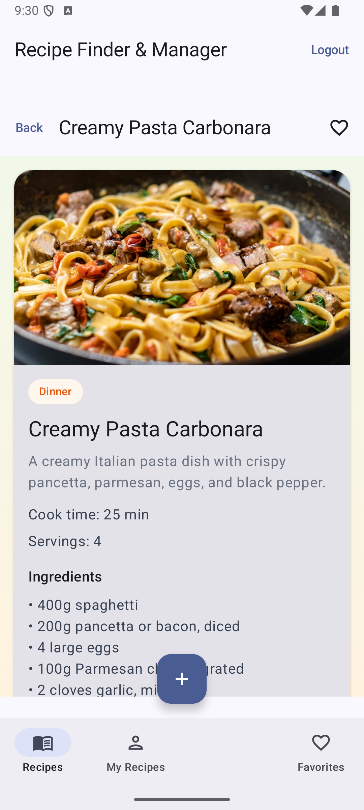

# Recipe Finder Manager

Final project - Android UI Development  
Daniel Noy, 209131689

Android app for finding and managing recipes. Users can sign up, add recipes, search, save favorites, and see recipes shared by other users.

## Demo video

[Watch demo](docs/demo.mp4)

## Screenshots







## Main features

- Login / Sign up / Forgot password (Firebase Auth)
- Public recipe list with search (Firestore)
- Add, edit and delete your own recipes
- My Recipes tab
- Favorites per user
- Sample recipes on first launch
- Image upload support (Firebase Storage - needs Blaze plan)

## Technologies

Kotlin, Jetpack Compose, Material 3, Navigation Compose, Firebase Auth, Firestore, Storage, Coil

## How to run

1. Open the project in Android Studio
2. Put `google-services.json` inside `app/`
3. Run on emulator or phone with internet

```bash
./gradlew :app:assembleDebug
```

## Firebase

- Project: `recipefindermanager`
- Recipes are saved in the `recipes` collection
- Rules files: `firestore.rules`, `storage.rules`

## Project folders

- `data` - models and Firebase code
- `viewmodel` - screen logic
- `ui` - Compose screens

## GitHub

Repo link: https://github.com/daniel-noy98/RecipeFinderManager

Contact: daniellofir98@gmail.com
